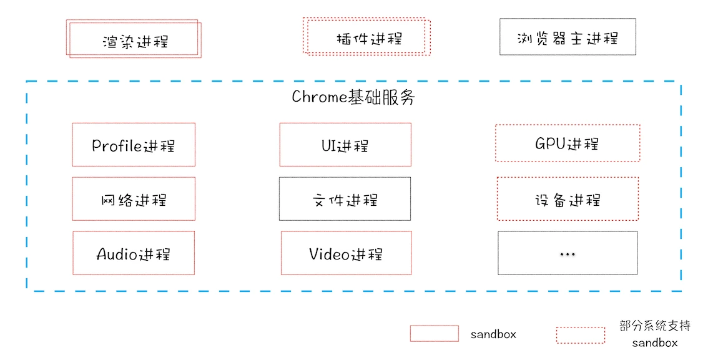

# chrome的架构组成

因为大部分浏览器的都是基于chromium二次开发的，所以这里选择分析早期浏览器的发展和chrome浏览器的架构。[(提前复习线程与进程相关的知识)](/os/thread)

### 浏览器的过去 - 单进程浏览器时代

**单进程浏览器是指浏览器的所有功能模块都是运行在同一个进程里**，这些模块包含了网络、插件、JavaScript 运行环境、渲染引擎和页面等。

如此多的功能模块运行在一个进程里，是导致单进程浏览器**不稳定**、**不流畅**和**不安全**的一个主要因素。

1. 不稳定
早期浏览器需要实现复杂的需求不得不大量借助插件。而**插件模块**是十分不稳定的，十分容易崩溃，而一个插件崩溃就会影响整个进程的崩溃。除此之外**渲染引擎模块**同理

2. 不流畅
大部分的模块都是运行在同一个线程（主要是**页面线程**）中，而一个线程只能同步的执行task, 例如 页面脚本的执行会影响页面的渲染或者插件的执行，反之亦然。

3. 不安全
**插件**可以使用 C/C++ 等代码编写，通过插件可以获取到操作系统的任意资源，当你在页面运行一个插件时也就意味着这个插件能完全操作你的电脑。如果是个恶意插件，那么它就可以释放病毒、窃取账号密码，引发安全性问题。
而**页面脚本**，可以通过浏览器的漏洞来获取系统权限，这些脚本获取系统权限之后也可以对电脑做一些恶意的事情，同样也会引发安全问题。

### 浏览器的现在 - 多进程浏览器时代

#### 早期的多进程架构

1. 浏览器主进程
    主要负责下载资源、管理IPC、显示渲染进程生成的图片
2. 渲染进程
    负责 解析、渲染、JS执行、合成网页图片
3. 插件进程

##### 为什么这么设计可以解决上述的问题？

1. 由于进程是相互隔离的，所以当一个页面或者插件崩溃时，影响到的仅仅是当前的页面进程或者插件进程，并不会影响到浏览器和其他页面。

2. 由于JS的执行被放到了渲染进程，所以即使JS的执行阻塞了渲染进程也仅仅只是影响当前页面的渲染。

3. Chrome 把插件进程和渲染进程锁在沙箱里面。可以把沙箱看成是操作系统给进程上了一把锁，沙箱里面的程序可以运行，但是不能在你的硬盘上写入任何数据，也不能在敏感位置读取任何数据，例如你的文档和桌面。这样即使在渲染进程或者插件进程里面执行了恶意程序，恶意程序也无法突破沙箱去获取系统权限。

#### 目前的多进程架构

1. **浏览器进程**。主要负责界面显示、用户交互、子进程管理，同时提供存储等功能。
2. **渲染进程**。核心任务是将 HTML、CSS 和 JavaScript 转换为用户可以与之交互的网页，排版引擎 Blink 和 JavaScript 引擎 V8 都是运行在该进程中，默认情况下，Chrome 会为每个 Tab 标签创建一个渲染进程。出于安全考虑，渲染进程都是运行在沙箱模式下。
3. **GPU 进程**。其实，Chrome 刚开始发布的时候是没有 GPU 进程的。而 GPU 的使用初衷是为了实现 3D CSS 的效果，只是随后网页、Chrome 的 UI 界面都选择采用 GPU 来绘制，这使得 GPU 成为浏览器普遍的需求。最后，Chrome 在其多进程架构上也引入了 GPU 进程。
4. **网络进程**。主要负责页面的网络资源加载。
5. **插件进程**。主要是负责插件的运行，因插件易崩溃，所以需要通过插件进程来隔离，以保证插件进程崩溃不会对浏览器和页面造成影响。

##### 多进程架构带来的问题

1. **更高的资源占用**。因为每个进程都会包含公共基础结构的副本（如 JavaScript 运行环境），这就意味着浏览器会消耗更多的内存资源。
2. **更复杂的体系架构**。浏览器各模块之间耦合性高、扩展性差等问题，会导致现在的架构已经很难适应新的需求了。

#### 未来面向服务的架构
为了解决这些问题，在 2016 年，Chrome 官方团队使用“面向服务的架构”（Services Oriented Architecture，简称 SOA）的思想设计了新的 Chrome 架构。

