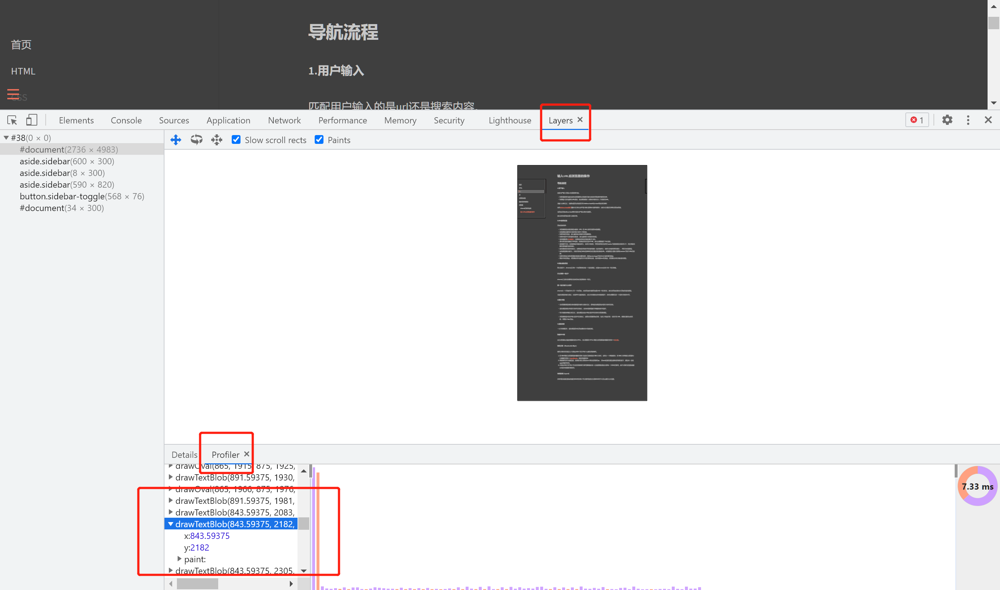

# 输入URL后浏览器的操作

### 导航流程

##### 1.用户输入
匹配用户输入的是url还是搜索内容。

* 如果是搜索内容则会使用浏览器默认的搜索引擎合成新的带搜索关键词的URL
* 如果输入的内容符合URL规则，就会根据规则（例如补充协议头）生成新的URL。

当输入回车之后，当前标签页还有触发关于beforeunloadh和unload等相关的事件

而在[beforeunload事件](https://developer.mozilla.org/zh-CN/docs/Web/API/Window/beforeunload_event)里则可以询问用户是否确认要离开当前等操作，因此可以通过它来取消页面导航。

当页面没有beforeunload事件或者用户确认离开当前页。

那么新的网页就会进入加载状态。

##### 2.URL请求过程
页面资源请求:
* 浏览器进程会通过进程间通信（IPC）把 URL 请求发送至网络进程。
* 网络进程会查找本地缓存是否缓存了该资源。
* 如果有缓存资源，那么直接返回资源给浏览器进程。
* 如果在缓存中没有查找到资源，那么直接进入网络请求流程。
* 请求前要进行[DNS解析](/network/dns-parse)，以获取请求域名的服务器 IP 地址。
* 跟对应的服务器建立TCP连接，如果请求协议是 HTTPS，那么还需要建立 TLS 连接。
* 连接建立之后，网络进程会构建请求行、请求头等信息，并把和该域名相关的 cookie 等数据附加到请求头中，然后向服务器发送构建的请求信息。
* 服务器接收到请求信息后，会根据请求信息生成响应数据（包括响应行、响应头和响应体等信息），并发给网络进程。
* 网络进程解析响应头，判断状态码为301或者302时则去重定向到其他URL。网络进程又重新去获取Location字段中URL的资源。
* 如果状态码为200浏览器则继续处理该响应。通过content-type字段去区分响应体的类型。
* 根据不同的类型，浏览器会将内容交给不同的模块处理，当发现是html的类型，浏览器会开始准备渲染进程。

##### 3.准备渲染进程
默认情况下，chrome会为每一个网页单独分配一个渲染进程，但是chrome还有个同一站点策略。

###### 什么算同一站点？
chrome认为协议和根域名相同的网点就算做同一站点。
###### 同一站点有什么不同？
chrome从一个页面打开了另一个新页面，而新页面和当前页面属于同一站点的话，那么新页面会复用父页面的渲染进程。

当渲染进程准备完成后，但是并不会直接渲染，因为文件数据还在网络进程中，此时还需要经过一个提交文档的环节。

##### 4.提交文档
* 当浏览器进程接收到网络进程的响应头数据之后，便向渲染进程发起“提交文档”的消息。

* 渲染进程接收到“提交文档”的消息后，会和网络进程建立传输数据的“管道”。

* 等文档数据传输完成之后，渲染进程会返回“确认提交”的消息给浏览器进程。

* 浏览器进程在收到“确认提交”的消息后，会更新浏览器界面状态，包括了安全状态、地址栏的 URL、前进后退的历史状态，并更新 Web 页面。

### 渲染流程

##### 渲染进程-主线程
一旦文档被提交，渲染进程便开始页面解析和子资源加载。

###### 构建DOM树
因为浏览器无法直接理解和使用 HTML，所以需要将 HTML 转换为浏览器能够理解的结构——[DOM树](https://developer.mozilla.org/zh-CN/docs/Web/API/Document_Object_Model)。

###### 样式计算（Recalculate Style）

样式计算的目的是为了计算出 DOM 节点中每个元素的具体样式。
1. 把 CSS 转换为浏览器能够理解的结构
当渲染引擎接收到 CSS 文本时，会执行一个转换操作，将 CSS 文本转换为浏览器可以理解的结构——[styleSheets](https://developer.mozilla.org/zh-CN/docs/Web/API/StyleSheet)。(类似构建DOM)
2. 转换样式表中的属性值，使其标准化
例如将rem 转化成具体的px， 将bold这类的属性值转成具体的数字，颜色同一变成rgba的格式等等。
3. 计算出 DOM 树中每个节点的具体样式
样式被转换和统一后就要根据规则计算每一个DOM的样式。其中计算的过程是遵循css**继承**和**层叠**的规则的。

###### 布局阶段 (Layout)
在布局阶段通过前面构建的DOM树和每个节点样式信息去计算DOM树中可见元素的几何位置。
1. 创建布局树
    * 遍历 DOM 树中的所有可见节点，并把这些节点加到布局树中。
    * 忽略掉不可见的节点。例如display：none的元素。

2. 布局计算 

  计算布局树节点的坐标位置，并将布局运算的结果重新写回布局树中。

###### 分层（Layer）
渲染引擎还需要为特定的节点生成专用的图层，并生成一棵对应的图层树（LayerTree）。

浏览器的页面实际上被分成了很多图层，这些图层叠加后合成了最终的页面。

通常情况下，并不是布局树的每个节点都包含一个图层，如果一个节点没有对应的层，那么这个节点就从属于父节点的图层。

**什么情况下浏览器会为特定的节点创建新的图层？**
1. 拥有层叠上下文属性的元素会被提升为单独的一层。
2. 需要剪裁（clip）的地方也会被创建为图层。

###### 图层绘制 (Paint)
这个阶段会把一个图层的绘制拆分成很多小的绘制指令，然后再把这些指令按照顺序组成一个待绘制列表。

当图层的绘制列表准备好之后，主线程会把该绘制列表提交给合成线程。

##### 渲染进程-合成线程
###### 分块（tiles）
合成线程会将较大、较长的图层（一屏显示不完，大部分不在视口内）划分为图块
###### 栅格化（raster）

将图块在光栅化线程池中转换成位图。

##### 浏览器进程
###### 合成和显示（display）
一旦所有图块都被光栅化，**合成线程**发送绘制图块命令DrawQuad给**浏览器进程**。

浏览器进程根据DrawQuad消息生成页面，并显示到显示器上。

### 为什么会引起重排、重绘？
##### 1. 重排
因为更新了元素的几何属性需要重新经历Layout及之后的阶段。

例如改变元素的宽高。

##### 2. 重绘
因为更新了元素的绘制属性需要重新生成绘制指令。

例如修改元素的背景等。

