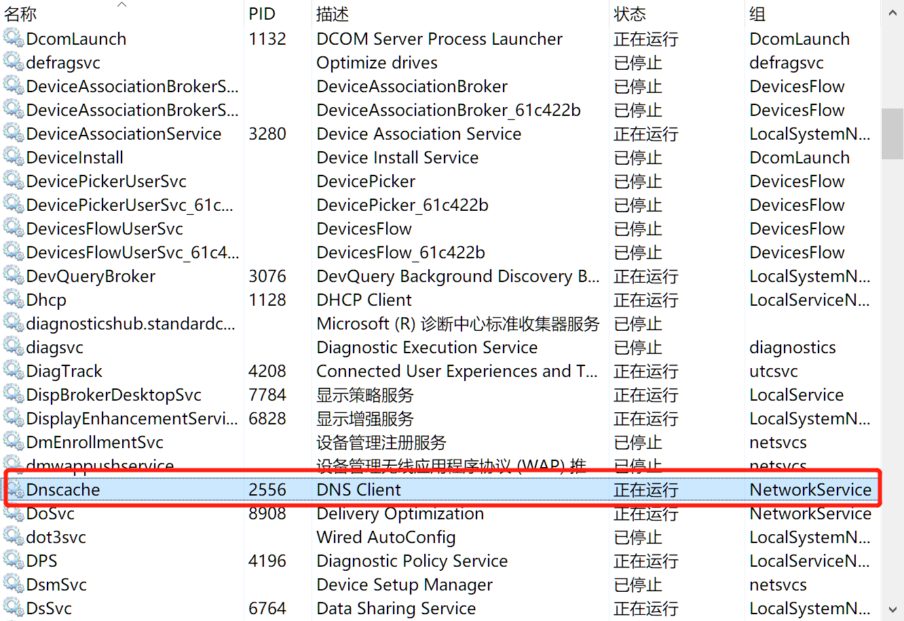

# DNS解析

1. 浏览器先检查自身缓存中有没有被解析过的这个域名对应的ip地址，如果有，解析结束。同时域名被缓存的时间也可通过TTL属性来设置。

2. 如果浏览器缓存未命中，浏览器会检查操作系统dns缓存中有没有对应的已解析过的结果。

3. 如果dns缓存还是未命中，会去操作系统的hosts文件匹配。

4. 此时若还未命中域名。则会向本地域名服务器（LDNS）发送。一般为DHCP分配到的运营商的服务器地址。

5. 若还没命中域名。则会向根域名服务器发送请求，根域名服务器会返回一个顶级域名服务器IP给到LDNS。

6. 然后LDNS继续向顶级域名服务器发送请求。然后返回权威域名服务器的IP

7. 最后LDNS再访问权威域名服务器得到该域名的ip

8. LDNS 缓存这个映射关系，并将ip返回给用户。
